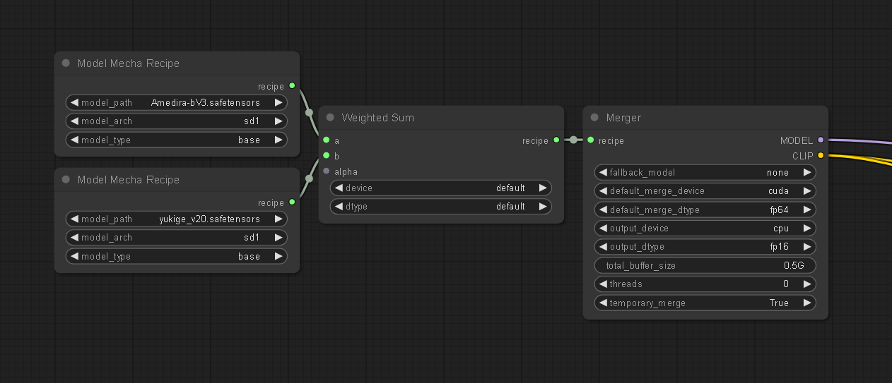
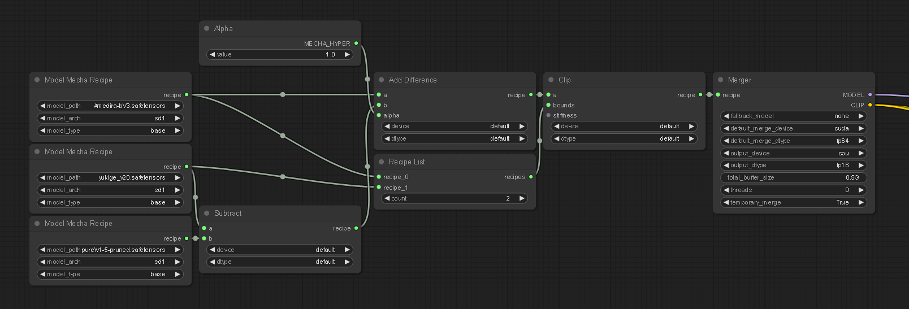
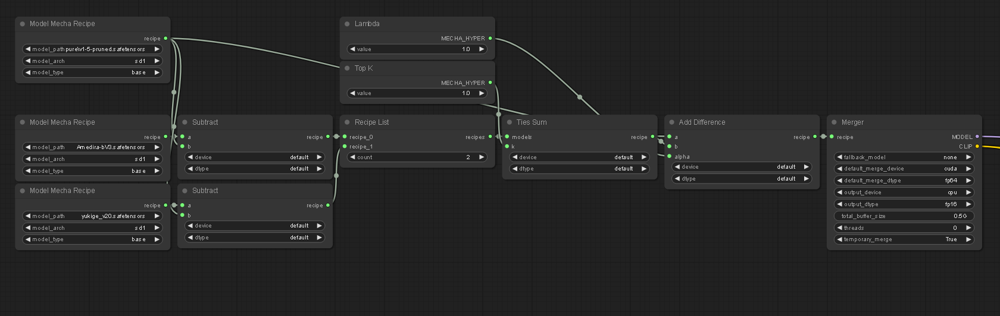

# sd-mecha for Comfyui

comfy-mecha is a complete model merging node pack for ComfyUI with a focus on low memory footprint.  
- compose complex recipes without needing to save dozens of intermediate merges to disk
- merge loras to models
- support for block weights
- and a bunch of other stuff. For more info, see the nodes listing below. See also the readme of the underlying library [sd-mecha](https://github.com/ljleb/sd-mecha)

## Workflows

### Basic weighted sum

### Clipped add difference

### Ties merging

Recipe workflows can get much, much more complex than this.  
If you are familiar with writing python code, you might be interested in using the sd-mecha library directly for experiments instead of ComfyUI: https://github.com/ljleb/sd-mecha

## Node listing

### Merge nodes

Nodes used for merging. They all have `Recipe` in their name except for `Mecha Merger`.

- nodes ending in `... Mecha Recipe` return a merge recipe
- `Mecha Merger` takes a `MECHA_RECIPE` as input, and returns a unet and a text encoder
- `Mecha Model Recipe` loads a model as a recipe to be used as input to other recipe nodes. model architecture detection is not yet supported, so please make sure the right `arch` parameter is selected!
- `Mecha Recipe List` takes an arbitrary number of recipes and returns a `MECHA_RECIPE_LIST`. It is intended to be used as input to recipe nodes that accept an arbitrary number of recipes as input, i.e. the `bounds` input of `Clip Mecha Recipe`
- `Mecha Custom Code Recipe` is a very experimental node for custom code and might be removed eventually. It is hard to create recipes and debug with it. I'd advise against using it and instead registering a custom merge method using the sd-mecha library directly

### Hyper nodes

Nodes used to specify hyper(parameters) to merge methods. For example, `Weighted Sum Mecha Recipe` has a hyper input `alpha` with a default value of `0.5`.

- `Blocks Mecha Hyper` can specify a different hyper for each block of the models to be merged (AKA "merge block weighted" or "MBW")
- `Float Mecha Hyper` specifies the same float for all blocks of the models to be merged
